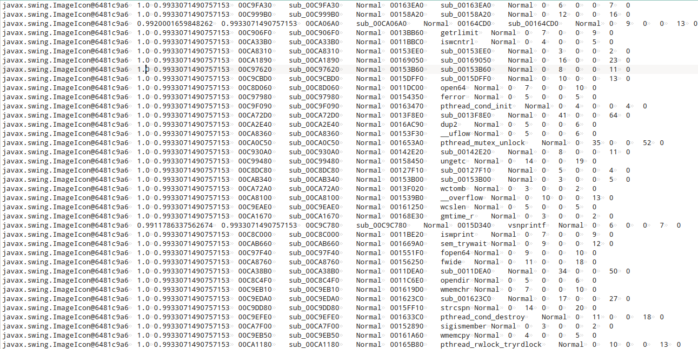

# bindiff ghidra importer
A Ghidra script that renames functions based on a CSV file from the bindiff tool, with filtering.

## Installation

In Ghidra, open Tools -> Script manager -> Manage directories and add the directory containing the script (this one)

You should now see a new cathegory called "bindiff scripts", inside which you will find this script and you will be able to start it.

## Example

I have a statically linked stripped binary that I know it is using the GNU libc library.

It would be great to at least recover libc's symbols, so that you don't have to analyze library functions to understand what they do.

Steps:
- Open the binary you want to analyze in Ghidra
- Open the libc library in Ghidra (try to get the version was linked to the binary for better results)
- Export both programs using [BinExport](https://github.com/google/binexport)
- Open [bindiff](https://www.zynamics.com/software.html) and create a new diff
- In the "Matched Functions" view select all the functions and right click -> copy selection

    

    > _NOTE_: You could also select only the ones you want to import, but the script also provide some basic filtering (minimum similarity and confidence).
    > Feel also free to edit the script and add more complex filtering, by editing the `filterFn` function

- Paste the selection in a file, should look something like this:

    

We are now ready to start the script.
Upon starting the script you will be asked for the CSV file and some filtering parameters, after that you should be all set

